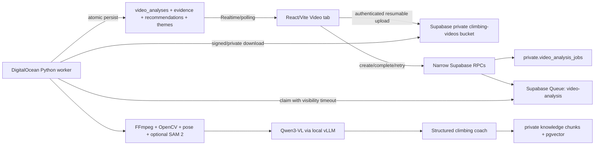

# Open-Source Video Intelligence and Climbing Coach Design

**Date:** 2026-07-16  
**Status:** Approved for implementation  
**Repository baseline:** `mateosauton/climb-training@5e6fb03`  
**Database:** dedicated Supabase project `romannlfmjkukbypkrqw`

## Outcome

Add asynchronous, evidence-based climbing-video analysis to the current Climb Training product without creating a second persistence domain. The system decodes the complete uploaded clip, derives deterministic motion and pose signals, selects timestamped evidence sequences, and asks a self-hosted vision-language model for strictly structured observations. A separate coaching stage combines those observations with the athlete's current plan, recent load, pain flags, prior analyses, and a reviewed climbing-knowledge corpus.

The default model path is open source and self-hosted. OpenAI is an optional provider behind the same interface, not a database, retrieval, or runtime dependency.

## Corrected current state

The previous video design targeted a different repository and the shared “Dropping Air” Supabase project. Those assumptions are obsolete.

The current implementation is the `climb-training` repository and its dedicated Supabase project. PR [#12](https://github.com/mateosauton/climb-training/pull/12) establishes Supabase-primary persistence with:

- [`public.video_assets`](https://github.com/mateosauton/climb-training/blob/5e6fb03/supabase/migrations/20260715165843_activity_media.sql) for private-video metadata and upload/processing state;
- [`public.video_analyses`](https://github.com/mateosauton/climb-training/blob/5e6fb03/supabase/migrations/20260715165843_activity_media.sql) for immutable versioned analysis payloads;
- [`public.append_video_analysis`](https://github.com/mateosauton/climb-training/blob/5e6fb03/supabase/migrations/20260715194000_append_video_analysis.sql) for owner-scoped analysis append;
- the private `climbing-videos` Storage bucket using `{athlete_id}/{video_id}/...` object paths;
- [`createCloudVideoService`](https://github.com/mateosauton/climb-training/blob/5e6fb03/src/features/cloud/cloud-video.ts) for authenticated upload verification, playback URLs, and analysis persistence;
- athlete identity derived from Supabase Auth and protected by RLS.

This design extends those structures. It does not introduce `climb_*` duplicates, a second video bucket, a second auth model, or an OpenAI vector store.

## Goals

1. Analyze uploaded videos asynchronously while preserving the existing upload and recovery lifecycle.
2. Inspect every source frame with deterministic code while limiting VLM input to useful evidence sequences.
3. Produce timestamped, confidence-scored observations that distinguish visible facts from inference and unknowns.
4. Produce safe coaching recommendations tied to video evidence and reviewed sources.
5. Preserve immutable analysis and recommendation history across devices.
6. Support retry, feedback, comparison, deletion, and longitudinal theme tracking.
7. Keep the model provider replaceable and make open-source inference the default.
8. Use only footage with documented training rights, consent, and provenance.

## Non-goals

- Medical diagnosis, injury classification, or replacement of an in-person coach.
- Exact 3D force or biomechanics reconstruction from a single consumer camera.
- Sending every frame to a VLM.
- Training a foundation model from scratch.
- Scraping arbitrary YouTube, Instagram, competition, or gym footage.
- Automatically changing the training plan without athlete confirmation.

## Model approaches considered

### Open-source-first hybrid — selected

Use FFmpeg/OpenCV plus pose and segmentation models for reproducible signals, then Qwen3-VL-8B-Instruct for temporal visual reasoning and structured observations. Serve Qwen through vLLM's OpenAI-compatible API on a DigitalOcean GPU Droplet. Use the same provider abstraction for the text-only coaching stage. This provides privacy, provider control, and a practical path to climbing-specific fine-tuning.

### OpenAI-primary with open-source shadow evaluation

This minimizes initial model-operations work but retains provider cost, retention, and portability concerns. It remains a supported fallback and benchmark, not the default.

### Deterministic computer vision only

Pose, optical flow, segmentation, and heuristics are cheap and auditable, but they cannot reliably explain route-reading, movement intent, pacing, or coaching context. They remain mandatory supporting signals rather than the complete analyzer.

## Open-source stack

| Responsibility | Selected component | License and rationale |
|---|---|---|
| Video decoding and normalization | FFmpeg, OpenCV | Mature local processing; no raw video leaves trusted infrastructure. |
| Body landmarks | MediaPipe Pose initially; RTMPose evaluation path | Both have Apache-2.0 implementations. MediaPipe is simpler to operate; RTMPose is the likely climbing fine-tuning base. |
| Video object tracking | SAM 2.1, optional | Apache-2.0 promptable segmentation/tracking for climber and hold crops. It must not block V1. |
| Primary VLM | Qwen3-VL-8B-Instruct | Apache-2.0, native video/timestamp support, 2B/4B/8B sizes, and documented vLLM serving. |
| Long-video challenger | InternVideo3-8B-Instruct | Apache-2.0 and designed for long-horizon temporal reasoning, but too new to be the initial production default. |
| Mature challenger | InternVideo2.5-Chat-8B | Apache-2.0 and established video benchmarks; heavier/more specialized serving stack. |
| Excluded default | VideoLLaMA3 | Code is Apache-2.0, but its repository describes the service as a non-commercial research preview and flags upstream data/model terms. It requires legal review before commercial use. |
| Retrieval | Supabase pgvector plus open embeddings | Keeps source chunks, provenance, and retrieval in the existing database. V1 may use Supabase's open `gte-small` embedding path. |
| Optional fallback | OpenAI provider adapter | Disabled unless separately configured; uses the same schemas and never owns history or retrieval. |

Primary sources are listed under **References**.

## Runtime architecture



### Client

The existing Vite app keeps using only `VITE_SUPABASE_URL` and `VITE_SUPABASE_PUBLISHABLE_KEY`. It creates an owned `video_assets` row, uploads with TUS to the direct Storage hostname, verifies upload completion, and requests analysis through an authenticated RPC. It never receives the worker token, service-role key, database password, or model credentials.

### Supabase

The existing `video_assets` and `video_analyses` tables remain authoritative. New migrations add:

- `private.video_analysis_jobs`: lifecycle, attempt, progress, pipeline/model versions, checkpoints, safe error, usage, and correlation ID;
- `private.video_pipeline_events`: stage-level timings and non-sensitive diagnostics;
- `public.video_evidence`: owned evidence-frame metadata and private object paths;
- `public.video_observations`: immutable visible facts, visibility class, confidence, category, and evidence references;
- `public.video_recommendations`: immutable recommendation text plus mutable owner state;
- `public.video_recommendation_feedback`: append-only athlete outcomes and notes;
- `public.video_theme_snapshots`: derived recurring/improving/resolved/regressed state;
- `private.knowledge_sources` and `private.knowledge_chunks`: reviewed source provenance, text chunks, embedding-model version, and vectors;
- a private durable `video-analysis` PGMQ queue.

Browser roles receive no direct queue or `private` schema grants. Narrow security-definer RPCs validate `auth.uid()`, object ownership, allowed transitions, and idempotency. Worker persistence uses a server credential and rechecks the job/video/athlete relationship rather than trusting message contents.

### DigitalOcean worker

V1 runs on one `gpu-l40sx1-48gb` Droplet in `tor1`, using DigitalOcean's NVIDIA AI/ML-ready image. The observed account catalog price on 2026-07-16 is USD 1.57/hour. Continuous operation is therefore roughly USD 1,130/month before bandwidth or snapshots; rollout must include a budget alert and an explicit shutdown/destroy policy during private evaluation.

The Droplet runs:

- `vllm` bound only to localhost for Qwen3-VL;
- a containerized FastAPI worker API;
- a queue-drain loop with bounded concurrency of one analysis per GPU;
- FFmpeg/OpenCV/pose dependencies;
- health and readiness endpoints;
- a host firewall exposing only SSH and the authenticated worker health/control endpoint, if needed.

The worker uses signed, short-lived object URLs or the server-side Storage client. It does not make the bucket public. Model weights and temporary normalized videos live on the Droplet's local/scratch storage; temporary athlete media is erased after persistence.

## End-to-end flow

1. Athlete uploads a video through the existing `createCloudVideoService` lifecycle.
2. An authenticated `request_video_analysis(video_asset_id, idempotency_key)` RPC verifies that the asset is owned and uploaded, creates/reuses a private job, sets `processing_status = 'processing'`, and queues IDs only.
3. Worker claims the message, loads the authoritative job and asset, and transitions the job to `validating`.
4. FFprobe validates container, codec, duration, dimensions, frame rate, and decompression bounds.
5. FFmpeg decodes the entire clip. OpenCV computes quality, motion, blur, exposure, scene change, and duplicate signals for every frame.
6. MediaPipe/RTMPose provides supporting keypoints. SAM 2 may track selected climber/hold regions when it improves evidence quality.
7. The selector groups setup, movement, capture, stabilization, recovery, rest, and fall phases and emits at most 12 ordered sequences/60 evidence images.
8. Qwen3-VL returns only schema-valid observations referring to supplied sequence/frame IDs. Unsupported medical labels and missing evidence references are rejected.
9. Retrieval selects reviewed climbing-knowledge chunks. The coach stage combines observations, athlete context, pain/load gates, prior themes, and sources into at most five recommendations.
10. A trusted transaction appends one `video_analyses` version and all evidence, observations, recommendations, citations, and theme projections, then marks the job and asset completed.
11. Realtime updates the Video tab; polling is the fallback.
12. Retry resumes from stored checkpoints and never repeats completed model calls. Deletion removes the original, derived objects, private jobs, and user-visible history through a trusted idempotent workflow.

## Provider contract

The worker depends on two interfaces:

```python
class PerceptionProvider(Protocol):
    def analyze(self, request: PerceptionRequest) -> PerceptionResult: ...

class CoachProvider(Protocol):
    def coach(self, request: CoachRequest) -> CoachResult: ...
```

`QwenVllmProvider` is the default. `OpenAIProvider` is optional. Both must return the same strict JSON schemas; provider names, model revisions, quantization, prompt version, sampling settings, and schema versions are stored with each immutable analysis.

Provider output is untrusted until schema, evidence-reference, confidence-range, citation, and safety validation passes.

## Frame and evidence policy

- Decode and timestamp every source frame.
- Store low-cost quality/motion signals for selection, not every frame image.
- Preserve original source timestamps through rotation and normalization.
- Use 3–8 ordered frames per evidence sequence, with default caps of 12 sequences and 60 VLM images.
- Flag partial coverage when caps or poor framing omit relevant movement.
- Store only report evidence and thumbnails beneath `{athlete_id}/{video_id}/evidence/...` in the existing private bucket.
- Delete normalized/intermediate files after the job completes or fails terminally.
- Never claim exact forces, diagnoses, hold grades, or invisible joint state.

## Training and internet-video policy

“Use videos from the internet to train” means use datasets or individual works whose licenses explicitly permit the intended download, transformation, model-training, and commercial use. Public accessibility alone is not permission.

Every training/evaluation item must have a registry row containing source URL, creator/publisher, retrieval date, exact license/version, commercial-use permission, derivative/model-training permission, consent/person-status notes, checksum, split, and deletion/takedown state. Items without sufficient rights remain metadata-only and cannot enter training jobs.

Initial phases:

1. Register and download [The Way Up](https://zenodo.org/records/15196867), a 20.89 GB CC BY 4.0 dataset containing 22 climbing videos, 10 climbers, two routes, and 940 annotated hold usages. Preserve DOI, authors, attribution, license, and every transformation in the manifest.
2. Benchmark the unmodified Qwen/pose stack on a held-out portion of The Way Up and owner-supplied clips; prevent train/test leakage by climber and route.
3. Fine-tune the pose/hold-contact components on the licensed training split before changing the VLM.
4. Build instruction-tuning examples from reviewed evidence/coach labels only after provenance and consent review.
5. Use athlete uploads for training only through a separate explicit opt-in; product consent to analysis is not training consent.

The Way Up is sufficient for evaluation and targeted pose/hold-contact fine-tuning, not for training an 8B VLM from scratch. AscendMotion/ClimbingCap and CIMI4D are excluded from commercial training unless their authors grant separate commercial rights. YouTube's standard license is also excluded; only a verified compatible Creative Commons license plus third-party-rights review is acceptable.

Random social-media scraping, competition broadcasts, and gym footage without releases are prohibited.

## Video tab and history

The existing upload/manual-analysis experience becomes a single cloud workspace:

- upload and resumable progress;
- associated session and optional athlete question;
- named processing stages with retry/cancel;
- current report with quality, coverage, strengths, recommendations, confidence, and citations;
- evidence submodal with timestamped segment and ordered frames;
- recommendation actions: accept, dismiss, tried, resolved, regressed, and feedback note;
- reverse-chronological analysis history;
- filters by date, session, theme, status, and confidence;
- longitudinal theme view and comparison between videos;
- explicit partial, failed, deleted, and legacy-local states.

## Security and privacy

- Athlete UUIDs come from Supabase Auth, never request bodies or user metadata.
- All public athlete tables enable RLS; all private tables deny browser roles.
- The publishable key is allowed in the browser. Service-role/database/model/worker secrets are server-only.
- Queue messages contain identifiers, not signed URLs, tokens, raw prompts, or profile data.
- Logs exclude raw video, evidence images, prompts, responses, signed URLs, health data, and secrets.
- Worker endpoints require a rotating bearer secret and firewall restrictions; vLLM is never public.
- Training requires separate opt-in and provenance; deletion/takedown propagates to raw data and future dataset builds.
- Deterministic pain and load rules override generated coaching.

## Reliability and cost controls

- Stages are idempotent checkpoints keyed by `(job_id, stage, pipeline_version)`.
- Queue visibility exceeds the stage timeout; a watchdog safely retries stale jobs.
- Maximum three attempts with exponential backoff and sanitized failures.
- One active analysis per GPU and at most two queued/running jobs per athlete.
- Default limits: 500 MB, 10 minutes, 12 sequences, 60 VLM images, one repair attempt.
- Cache deterministic extraction by source checksum and pipeline version.
- Cache model results by evidence hash, prompt/schema version, and exact model revision.
- Budget alerts cover GPU uptime, queue age, failures, and daily analyses.

## Verification

### Database and authorization

- Clean migration and rollback tests on the current Supabase schema.
- Two-user RLS tests for assets, analyses, evidence, recommendations, feedback, and Storage prefixes.
- Browser roles cannot read private jobs, events, corpus chunks, or queues.
- Duplicate requests create one job; retries append no duplicate analysis version.
- Delete removes original and evidence objects plus derived history without crossing athlete boundaries.

### Worker

- Unit tests for validation, timestamp mapping, frame quality, deduplication, selection caps, provider schemas, citations, safety overrides, and checkpoints.
- Integration fixtures for valid climb, corrupt clip, no climber, poor framing, fall, timeout, malformed provider output, persistence retry, and queue redelivery.
- Container health/readiness tests and GPU smoke inference against a fixed licensed clip.

### Product

- Desktop/mobile upload, progress, completion, evidence, history, filters, feedback, retry, and deletion.
- Realtime failure with polling fallback.
- Accessibility for keyboard, focus containment, progress announcements, labels, contrast, and reduced motion.

### Model evaluation

Maintain a versioned, consented/licensed golden set with coach-reviewed evidence. Measure timestamp localization, unsupported-claim rate, evidence precision, recommendation usefulness, safety violations, latency, VRAM, and repeatability. Open-source promotion requires zero high-severity safety violations and thresholds agreed in the evaluation manifest; OpenAI comparison results do not bypass those gates.

## Rollout

1. Land schema and worker contracts behind `VITE_VIDEO_AI_ENABLED=false`.
2. Deploy Qwen/vLLM and the worker on the DigitalOcean L40S Droplet; validate health without production media.
3. Run licensed golden clips and database security tests in preview.
4. Enable only for the owner account with strict quotas.
5. Observe quality, privacy, queue latency, failure rate, and GPU spend.
6. Enable more users only after evaluation gates pass.

Rollback stops new queue submissions and drains/cancels pending work while preserving existing immutable reports and the current manual/legacy video flow.

## Acceptance criteria

- The implementation uses the dedicated `climb-training` Supabase project and extends its existing media schema.
- An authenticated athlete can resume upload and request analysis of only their own completed asset.
- A worker redelivery does not duplicate model spend or analysis history.
- The complete clip is decoded and selected evidence retains source timestamps.
- Every observation has visibility, confidence, and evidence references.
- Every recommendation is evidence-backed, safety-checked, and source-grounded when it makes factual prescriptions.
- History survives devices/reloads and exposes recurring, improving, resolved, and regressed themes.
- Original and derived data can be deleted through one idempotent trusted workflow.
- The default deployed provider is Qwen3-VL; OpenAI is optional and removable.
- No training item without verified rights/provenance enters a training job.

## References

- [Current Supabase database design](./2026-07-15-supabase-database-design.md)
- [Qwen3-VL repository and video/vLLM documentation](https://github.com/QwenLM/Qwen3-VL)
- [InternVideo3 model card](https://huggingface.co/yanziang/InternVideo3-8B-Instruct)
- [InternVideo2.5 model card](https://huggingface.co/OpenGVLab/InternVideo2_5_Chat_8B)
- [VideoLLaMA3 repository and license caveat](https://github.com/DAMO-NLP-SG/VideoLLaMA3)
- [MediaPipe repository](https://github.com/google-ai-edge/mediapipe)
- [MMPose/RTMPose repository](https://github.com/open-mmlab/mmpose)
- [SAM 2 repository](https://github.com/facebookresearch/sam2)
- [The Way Up climbing hold-usage paper](https://openaccess.thecvf.com/content/CVPR2025W/html/Maschek_The_Way_Up_A_Dataset_for_Hold_Usage_Detection_in_CVPRW_2025_paper.html)
- [The Way Up dataset record (CC BY 4.0)](https://zenodo.org/records/15196867)
- [Supabase resumable uploads](https://supabase.com/docs/guides/storage/uploads/resumable-uploads)
- [Supabase Queues](https://supabase.com/docs/guides/queues)
- [Supabase vector columns](https://supabase.com/docs/guides/ai/vector-columns)
- [DigitalOcean NVIDIA GPU image guidance](https://docs.digitalocean.com/products/droplets/getting-started/recommended-gpu-setup/)
